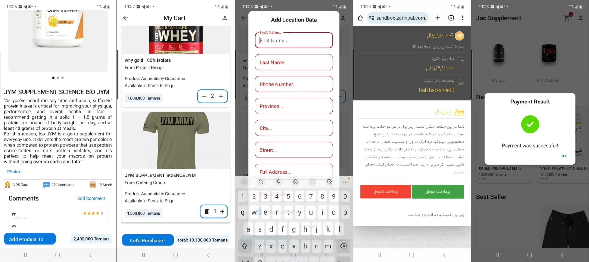

# Online Supplement Shop
[](link_to_license)

## Overview

The Online Supplement Shop is a project designed to provide a seamless and efficient online shopping experience for supplements. It is built using clean architecture principles, Kotlin coroutines for asynchronous programming, MVVM (Model-View-ViewModel) architecture, Room for local database storage, Retrofit for network operations, Koin for dependency injection, and Jetpack Compose for UI/UX.

## Features

- **Clean Architecture:** Follows the principles of clean architecture to create a modular and maintainable codebase.
- **Kotlin Coroutines:** Utilizes Kotlin coroutines for asynchronous and non-blocking programming, making the app more responsive.
- **MVVM Architecture:** Implements the MVVM architectural pattern to separate concerns and create a clear structure for the application.
- **Room:** Uses Room, a SQLite object-mapping library, for local data storage, providing a robust and efficient database solution.
- **Retrofit:** Incorporates Retrofit for handling API requests and responses, ensuring seamless communication with the backend.
- **Koin:** Implements Koin for dependency injection, making the codebase more modular and testable.
- **Jetpack Compose:** Leverages Jetpack Compose for building the UI, creating a modern and declarative approach to UI development.
- **Django Backend API:** Utilizes Django for the backend API, providing a powerful and scalable server-side solution.
## App Envirement


## Getting Started
1. **Clone the Repository:**
   ```bash
   git clone https://github.com/jacob6209/Shop-Supplements.git
2. **Clone the Repository For API:**
   ```bash
   https://github.com/jacob6209/OnlineShopSupplement_DRF.git
